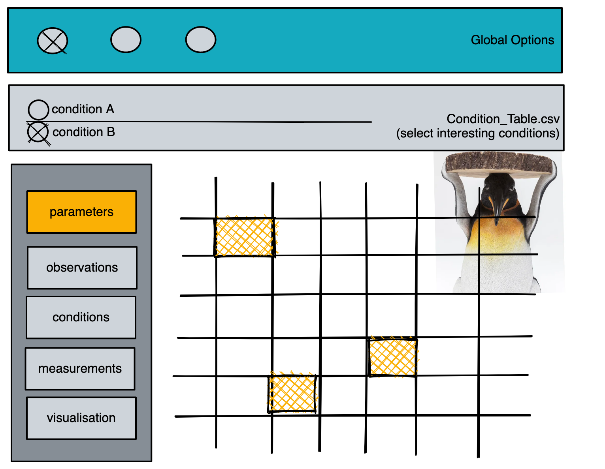

# PEnGUIn: PEtab Gui

## Aim
Facilitate access and visualization of PEtab problems.

## Work Packages
1. Visualization  
Check of correctness and iterative exploration;  
visualization of linked information (e.g. starting from experimental condition)

2. Interactive Extension  
Modifying tables via GUI; creating a PEtab problem from GUI

## Visualization UI Draft:

